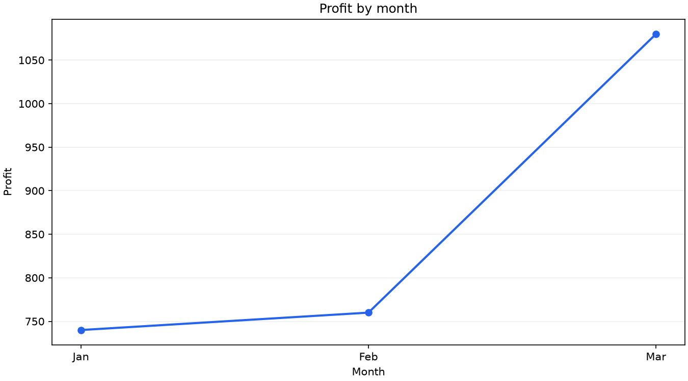

# 销售数据分析 Agent

基于 **LangChain / LangGraph + Pandas** 的课程实践项目：用自然语言查询销售指标、生成图表，并比较 ReAct、自定义状态图和 Plan-and-Execute 三种实现。

本项目定位为可复现的本地学习 Demo，不是生产级 BI 系统。提供不需要密钥的离线演示和模拟模型测试。维护者已确认获得课程公开许可，具体课程名称及许可依据仍待补充，详见 [来源与贡献](docs/PROVENANCE.md)。未声明全部原创，也未擅自添加通用开源许可证。

## 先看结果：不需要模型密钥

推荐 Python **3.11**。在项目根目录执行：

```bash
python3 -m venv .venv
source .venv/bin/activate
python -m pip install -r requirements-demo.txt
python demo.py
```

Windows 激活环境使用 `.venv\Scripts\activate`。该演示只读取随附的 9 条合成记录，输出 JSON 统计结果，并将图表写入 `outputs/`；不联网、不加载 `.env`、不连接 Redis。

| 检查项 | 合成样例的确定性结果 |
| --- | ---: |
| 总销售额 | 12,900 |
| 总利润 | 2,580 |
| 产品 A 总销量 | 720 |
| 按月汇总后的最高利润 | Mar：1,080 |
| Jan / Feb / Mar 利润 | 740 / 760 / 1,080 |

样例未定义币种，因此不添加货币单位。以下图表由当前代码实际生成，不是模型回答截图：



其他离线用法：

```bash
python demo.py --no-chart
python demo.py --csv /path/to/your.csv --output-dir outputs
```

同名生成图会覆盖输出目录中的上一张图。请勿把私有数据覆盖到已跟踪的 `sales.csv` 或公开演示图片中。

## 使用自然语言 Agent

```bash
python -m pip install -r requirements.txt
```

复制 `.env.example` 为 `.env`，填写自己的 `OPENAI_API_KEY`。如果已有 `.env`，保留原文件并补齐配置，不要覆盖密钥。

| 配置 | 含义 |
| --- | --- |
| `OPENAI_API_KEY` | 与所选服务地址匹配的密钥，变量名不限定服务商 |
| `LLM_BASE_URL` | 默认 OpenRouter 的 OpenAI 兼容接口 |
| `LLM_MODEL` | 默认 `openai/gpt-4`；请改为账号可用且支持工具调用的模型 |
| `REDIS_URL` / `LANGGRAPH_THREAD_ID` | 仅 Redis 入口使用 |

```bash
python state_graph_agent.py
```

可以问：“总销售额是多少？”“哪个月份的利润总额最高？”“产品 A 在 Mar 的销量是多少？”“画一张利润趋势图。”输入 `exit` 或 `quit` 退出。

也可只执行一个问题：

```bash
python state_graph_agent.py --question "哪个月份的利润总额最高？"
```

**运行模型入口会发送问题、会话和工具结果至配置的服务商，可能产生费用。** 目前未用真实模型验证完整对话效果；数值仍应对照工具结果核查。模型请求设有超时、有限重试及工具循环上限，这些不等于金额预算控制。

## 四个入口，共用一套分析工具

| 入口 | 实现 | 状态保存 |
| --- | --- | --- |
| `state_graph_agent.py` | 显式 Agent → Tools → Agent 循环 | 进程内检查点 |
| `react.py` | LangChain `create_agent` | 进程内检查点 |
| `pae.py` | 模型规划 1–5 步，再逐步执行并汇总结果 | 单次任务 |
| `redis_state_graph_agent.py` | 自定义状态图 + Redis | Redis 持久化 |

```bash
python react.py --question "各地区销售额是多少？"
python pae.py --question "统计总销售额、最高利润月份，再画利润趋势图"
```

Plan-and-Execute 不包含自动重规划或效果评估；计划格式不合法时终止，不会无限执行。内存历史随进程退出丢失。Redis 入口需另外安装 `requirements-redis.txt`，准备支持 RedisJSON / RediSearch 的 Redis，并配置 `.env` 后执行：

```bash
python -m pip install -r requirements-redis.txt
python redis_state_graph_agent.py --thread-id my-sales-session
```

复用会话标识会读取该标识的历史，不要跨用户共享；Redis 连接与恢复未在本次联网实测。

## 数据格式与指标口径

CSV 必须包含 `month, region, product, sales, profit, quantity`。

- `month` 支持 Jan–Dec（假设同一年）或 `YYYY-MM`（支持跨年），同一文件不可混用。
- 指标必须为有限数值；销售额、销量非负，销量为整数，利润允许为负。退货等负销售额业务需先扩展口径。
- 先按产品、月份、地区做精确筛选，再求和、记录均值、记录最小值或最大值。产品／地区筛选忽略大小写。
- “最高利润月份”是按月求和后排名，不是利润最高的一条记录；并列组全部返回。
- 无匹配数据返回空结果，不冒充零。缺月不补零，趋势会标出跨度；基期不大于零时不计算增长百分比。
- 工具使用明确参数，不再靠问题文本的关键词猜测；参数由模型选择，计算由 Pandas 完成。工具仍可能被模型选错，不能保证每次自然语言解析正确。

直接调用确定性计算：

```python
from sales_tools import SalesData

data = SalesData()
print(data.query("profit", "month", rank="highest"))
print(data.query("quantity", product="a", month="Mar"))
```

## 测试与项目维护

```bash
python -m unittest discover -s tests -v
```

测试不需要真实密钥。覆盖数据校验、筛选、排序、排名、趋势、图表、自定义图／ReAct 工具往返、会话隔离、执行次数限制和计划解析。2026-09-07 在已有环境及从官方 PyPI 全新安装的 Python 3.11 隔离环境中，均运行 **22 项测试通过**；新环境 `pip check` 通过，没有执行付费 API 调用。GitHub Actions 配置会在推送和 Pull Request 时运行测试；远程运行结果以 Actions 页面为准。

当前依赖入口只列直接依赖及已验证版本。`requirments.txt` 是保留的历史环境快照，不再被标准安装入口引用，也不是当前完整锁文件。未承诺其他 Python 版本或所有平台均兼容。

| 文件 | 用途 |
| --- | --- |
| `sales_tools.py` | 数据校验、查询、绘图、趋势、Agent 工具封装 |
| `agent_runtime.py` | 延迟初始化模型、提示词、CLI 与错误提示 |
| `demo.py` | 离线演示 |
| `tests/` | 无真实模型调用的自动化测试 |
| `create_data.py` | 生成合成样例，默认拒绝覆盖已有文件 |
| `docs/` | 数据政策、来源记录、演示图 |
| `CHANGELOG.md` / `CONTRIBUTING.md` | 版本变化和贡献流程 |

## 边界与安全

没有 Web UI、用户鉴权、生产数据库、任意 Python 执行或 Text-to-SQL。趋势不代表因果分析，也不是销售预测。CSV 存于内存，适用于小规模本地数据；未测试大数据吞吐或多人并发。

真实 `.env`、私有表格、缓存和会话不应提交。`.gitignore` 不会清理已经提交的历史密钥；若发生泄露，先轮换凭证。请阅读 [数据政策](docs/DATA_POLICY.md) 和 [安全说明](SECURITY.md)。
